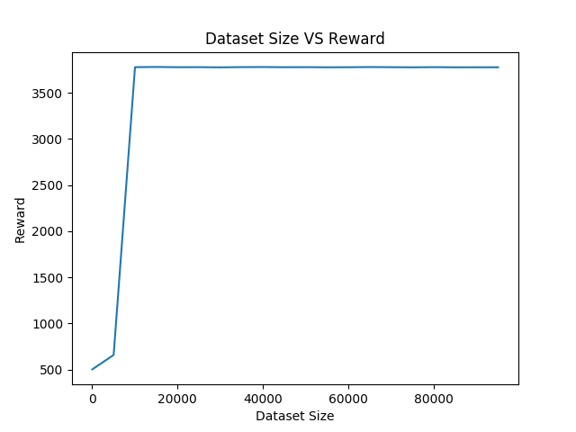

# CS294-112 HW 1: Imitation Learning

Dependencies:
 * Python **3.5**
 * Numpy version **1.14.5**
 * TensorFlow version **1.10.5**
 * MuJoCo version **1.50** and mujoco-py **1.50.1.56**
 * OpenAI Gym version **0.10.5**

Once Python **3.5** is installed, you can install the remaining dependencies using `pip install -r requirements.txt`.

**Note**: MuJoCo versions until 1.5 do not support NVMe disks therefore won't be compatible with recent Mac machines.
There is a request for OpenAI to support it that can be followed [here](https://github.com/openai/gym/issues/638).

**Note**: Students enrolled in the course will receive an email with their MuJoCo activation key. Please do **not** share this key.

The only file that you need to look at is `run_expert.py`, which is code to load up an expert policy, run a specified number of roll-outs, and save out data.

In `experts/`, the provided expert policies are:
* Ant-v2.pkl
* HalfCheetah-v2.pkl
* Hopper-v2.pkl
* Humanoid-v2.pkl
* Reacher-v2.pkl
* Walker2d-v2.pkl

The name of the pickle file corresponds to the name of the gym environment.

# Solutions

**Problem 2.2**

For both experiments:

1. Hidden layer = 128 units
2. Training Data Size = 100 rollouts = 100,000 timesteps
3. Epochs = 500
4. Test Data Size = 20 rollouts

**Hopper**

|                        | Expert Policy | Trained Model |
| :--------------------: | :-----------: | :-----------: |
|        **Mean**        | 3778.79126   |  3779.27708   |
| **Standard Deviation** |   3.03886    |    3.07484    |

**Humanoid**

|                        | Expert Policy | Trained Model |
| :--------------------: | :-----------: | :-----------: |
|        **Mean**        |  10306.80848  |   407.63263   |
| **Standard Deviation** |   979.44124   |   23.56048    |

**Problem 2.3**

The data size was varied and the rewards observed:

As the data size increases, the mean reward initially increases up to a certain point and then remains constant. Rationale: The size of data is one of the most important parameter of a model. If the data is not enough, the model will never be able to generalize well to the entire distribution from which the data is being drawn.
