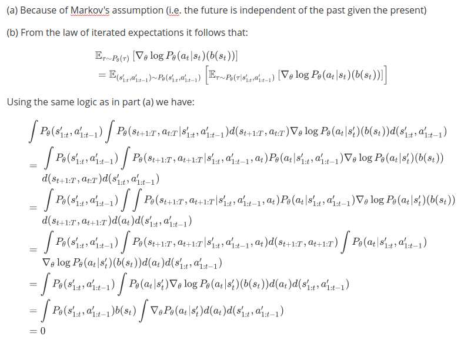

# CS294-112 HW 2: Policy Gradient

Dependencies:
 * Python **3.5**
 * Numpy version **1.14.5**
 * TensorFlow version **1.10.5**
 * MuJoCo version **1.50** and mujoco-py **1.50.1.56**
 * OpenAI Gym version **0.10.5**
 * seaborn
 * Box2D==**2.3.2**

Before doing anything, first replace `gym/envs/box2d/lunar_lander.py` with the provided `lunar_lander.py` file.

The only file that you need to look at is `train_pg_f18.py`, which you will implement.

See the [HW2 PDF](http://rail.eecs.berkeley.edu/deeprlcourse/static/homeworks/hw2.pdf) for further instructions.

# Solutions

**Problem 1**

**Part (a)**

**Part (b)**

**Problem 4**

(a) Reward-to-go.

(b) Yes. In the case of a large batch size the average returns are a bit more stable (after convergence) when the advantages were centered compared to when they were not. However, there is no noticeable effect for small batch sizes.

(c) Yes. For larger batch sizes a smaller number of iterations were required for convergence. Also, the graphs for average returns were more smoother (less fluctuations) for larger batch sizes.

**Problem 5**

It can be seen in the graph below that several different combinations of batch sizes and learning rates achieve the optimum return. One such example is a batch size of 1000 and a learning rate of 0.010.

**Problem 7**

**Problem 8**

(a) The following graph shows the effects that changing the batch size and learning rates had on the average returns. It can be seen that larger batch sizes and higher learning rates generally lead to higher average returns.  

(b) Choose $$b*=50000$$ and $$r*=0.020$$. The following graph shows the results with different settings of reward-to-go and baselines. 
