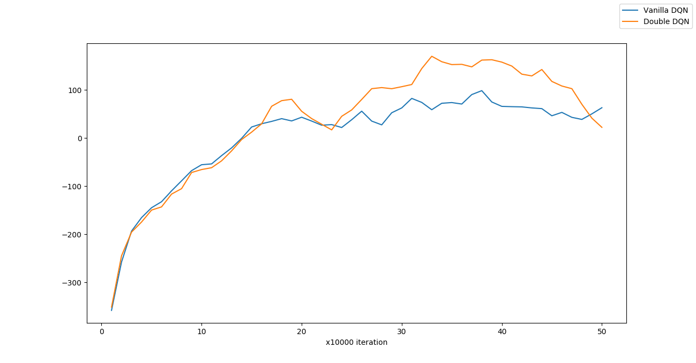
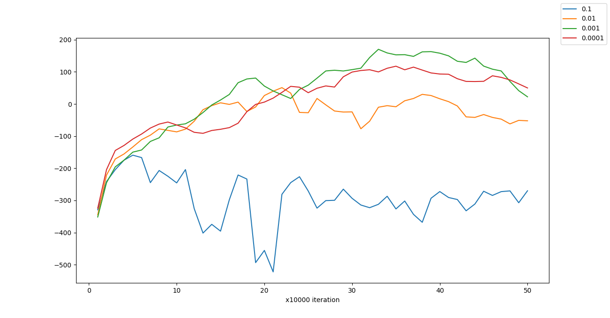
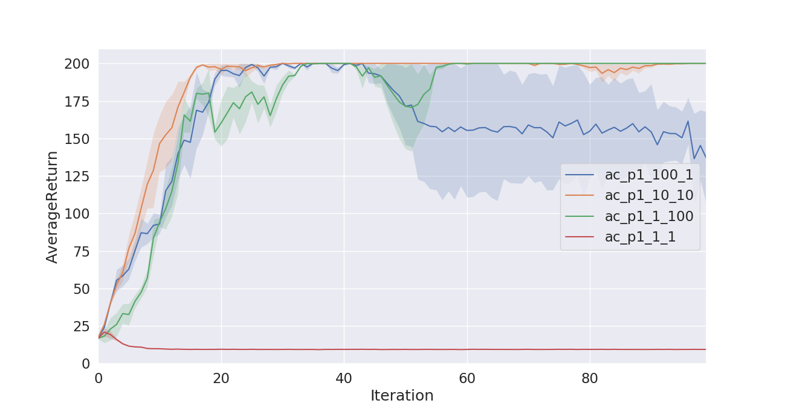
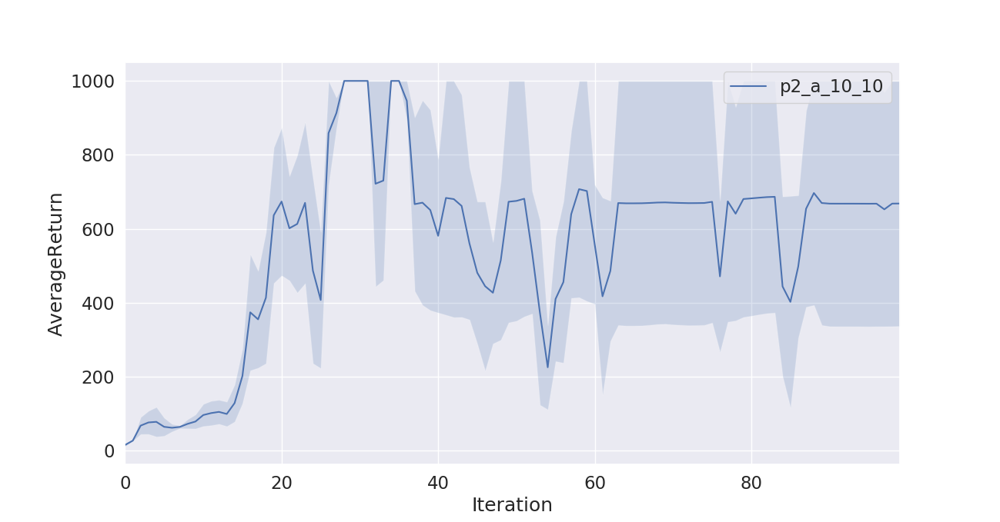
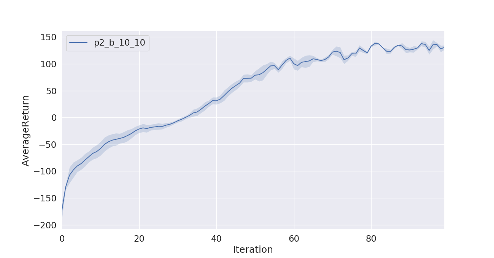

# CS294-112 HW 3: Q-Learning

Dependencies:
 * Python **3.5**
 * Numpy version **1.14.5**
 * TensorFlow version **1.10.5**
 * MuJoCo version **1.50** and mujoco-py **1.50.1.56**
 * OpenAI Gym version **0.10.5**
 * seaborn
 * Box2D==**2.3.2**
 * OpenCV
 * ffmpeg

Before doing anything, first replace `gym/envs/box2d/lunar_lander.py` with the provided `lunar_lander.py` file.

The only files that you need to look at are `dqn.py` and `train_ac_f18.py`, which you will implement.

See the [HW3 PDF](http://rail.eecs.berkeley.edu/deeprlcourse/static/homeworks/hw3.pdf) for further instructions.

The starter code was based on an implementation of Q-learning for Atari generously provided by Szymon Sidor from OpenAI.

# Solutions

### Q-Learning

**Problem 1**

I am still trying to arrange for some computational resources to run this problem. My laptop seems to be too old to run this kind of experiment :(

**Problem 2**

The following graph plots the average rewards for both the double Q-learning and vanilla Q-learning algorithms on the Lunar Lander game.

Clearly, double Q-learning performs much better than vanilla Q-learning.

**Problem 3**

We experiment with the learning rate. The graph below shows the average rewards plotted for four different settings of the learning rate for the Lunar Lander game.

It can be seen from the graph that a high learning rate (0.1) decreases the average rewards significantly. As the learning rate is lowered from 0.1 to 0.001 the average rewards increase. However, further lowering the learning rate to 0.0001 decreases the average rewards.

### Actor-Critic Algorithm

**Problem 1**

**Problem 2: Inverted Pendulum** 

**Problem 2: Half Cheetah** 
